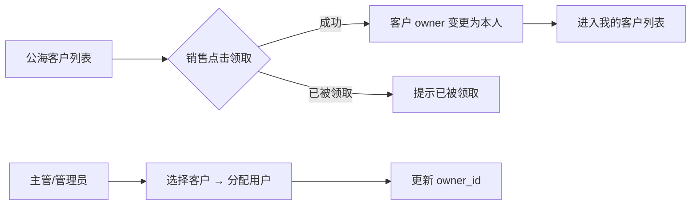
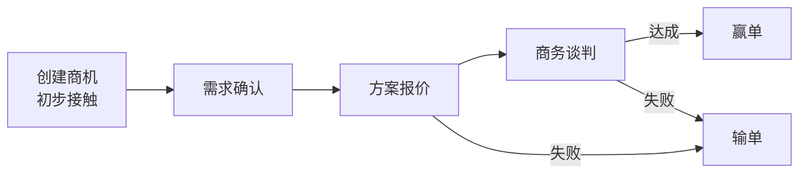
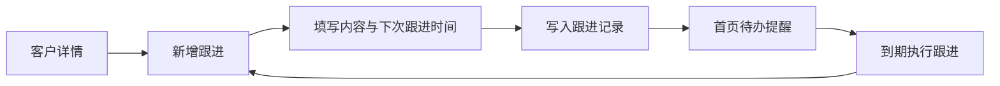
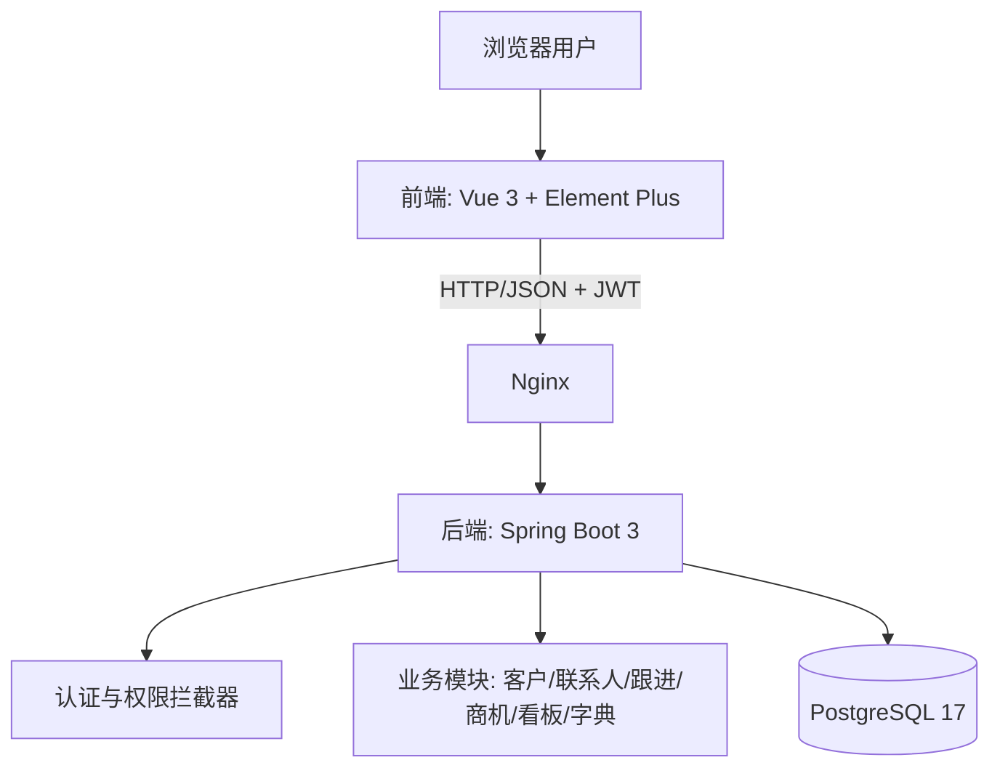
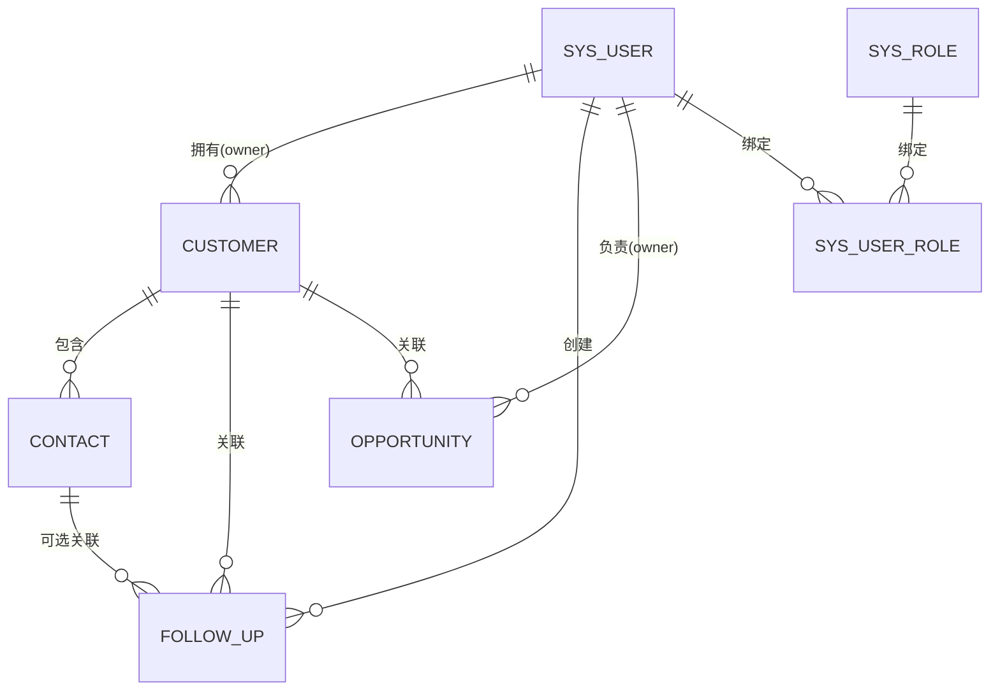

# 云客 CRM 系统设计文档

| 项目名称 | 云客 CRM 系统 |
| --- | --- |
| 文档版本 | v1.0 |
| 编写日期 | 2026-08-15 |
| 文档状态 | 初稿，待评审 |

---

## 1. 项目概述

### 1.1 项目背景

企业日常经营中，客户信息散落在 Excel、微信、纸质记录中，缺乏统一管理，导致：

- 客户资料查找困难，员工离职后客户信息流失；
- 跟进情况无记录，容易漏跟、重复跟进；
- 商机推进过程不透明，销售业绩难以统计。

本项目旨在构建一套**轻量、易用、可扩展**的 CRM（客户关系管理）系统，帮助中小团队集中管理客户、联系人、跟进记录与销售商机。

### 1.2 项目目标

- 提供统一的客户信息库，支持多维度检索；
- 记录每一次客户跟进过程，形成完整跟进时间线；
- 管理销售商机从创建、推进到赢单/输单的全过程；
- 提供数据看板，直观展示客户规模、商机金额与销售趋势；
- 支持多用户、角色化权限控制。

### 1.3 建设范围（一期）

| 模块 | 说明 |
| --- | --- |
| 用户与权限 | 登录、登出、用户管理、角色管理、权限控制 |
| 客户管理 | 客户增删改查、客户分类、客户分配与转移 |
| 联系人管理 | 联系人增删改查、联系人关联客户 |
| 跟进记录 | 跟进记录增删改查、按客户/联系人查看时间线 |
| 商机管理 | 商机增删改查、阶段推进、赢单/输单 |
| 数据看板 | 客户统计、商机统计、跟进统计 |
| 系统设置 | 数据字典（客户来源、行业、商机阶段等基础数据维护） |

> 一期**不包含**：合同管理、工单/售后、营销活动、报表导出（可放入二期）。

### 1.4 名词定义

| 名词 | 说明 |
| --- | --- |
| 客户（Customer） | 企业/组织级别的客户主体 |
| 联系人（Contact） | 客户下的具体人员，一个客户可有多个联系人 |
| 跟进记录（FollowUp） | 对客户/联系人的沟通、拜访、电话等记录 |
| 商机（Opportunity） | 潜在的销售机会，关联客户，有金额与阶段 |
| 所有者（Owner） | 客户/商机当前负责的销售用户 |

---

## 2. 角色与权限设计

### 2.1 角色定义

| 角色 | 说明 | 主要权限 |
| --- | --- | --- |
| 管理员（ADMIN） | 系统最高权限 | 全部功能，含用户管理、系统设置 |
| 销售主管（MANAGER） | 管理本团队客户与数据 | 查看全部数据、分配客户、查看看板 |
| 销售（SALES） | 普通业务人员 | 管理自己名下的客户/商机/跟进，查看公开数据 |
| 访客（GUEST，可选） | 只读账号 | 仅查看被授权的数据 |

### 2.2 数据权限

采用"**私有 + 公开 + 分配**"的简单模型：

- 客户拥有 `owner_id`（所有者），拥有者可完全操作；
- 未分配所有者的客户视为"公海客户"，所有销售可见并可领取；
- 销售主管可查看本团队（后续扩展部门概念）全部数据；
- 管理员可查看全部数据；
- 每个模块支持按 `owner_id` 过滤与按名称/电话模糊搜索。

### 2.3 权限控制方式

- 前端：根据用户角色控制菜单与按钮显隐；
- 后端：统一通过拦截器校验 JWT + 注解（如 `@RequirePermission`）做接口级鉴权，并校验数据归属；
- 权限粒度：模块级权限 + 数据级权限（本人/全部）。

---

## 3. 功能需求

### 3.1 用户认证与权限管理

| 功能 | 说明 | 优先级 |
| --- | --- | --- |
| 登录 | 账号密码登录，返回 JWT Token | P0 |
| 登出 | 前端清除 Token，可选服务端黑名单 | P1 |
| 修改密码 | 登录后可修改本人密码 | P1 |
| 用户管理 | 管理员维护用户账号、状态（启用/停用）、重置密码 | P1 |
| 角色管理 | 角色增删改查、角色与用户绑定 | P2 |
| 个人信息 | 查看/编辑本人昵称、头像、手机号 | P2 |

### 3.2 客户管理

| 功能 | 说明 | 优先级 |
| --- | --- | --- |
| 客户列表 | 分页列表，支持名称/电话/行业/来源/状态筛选与关键词搜索 | P0 |
| 新增客户 | 录入客户名称、行业、来源、电话、邮箱、地址、备注等 | P0 |
| 编辑客户 | 修改客户信息，记录修改日志 | P0 |
| 删除客户 | 逻辑删除；存在关联数据时给出提示（或级联软删） | P0 |
| 客户详情 | 展示基本信息 + 关联联系人 + 跟进时间线 + 关联商机 | P0 |
| 领取/分配 | 销售从公海领取客户；主管/管理员将客户分配给用户 | P1 |
| 转移 | 客户所有者变更，历史数据保留 | P1 |
| 客户状态 | 潜在客户/已合作/流失/暂停合作 等状态流转 | P1 |

### 3.3 联系人管理

| 功能 | 说明 | 优先级 |
| --- | --- | --- |
| 联系人列表 | 按客户、姓名、电话、职位查询 | P0 |
| 新增/编辑/删除 | 姓名、电话、邮箱、职位、微信、备注；必须关联客户 | P0 |
| 联系人详情 | 基本信息 + 跟进记录 | P1 |

### 3.4 跟进记录

| 功能 | 说明 | 优先级 |
| --- | --- | --- |
| 新增跟进 | 选择关联客户（必填）、可选联系人、跟进方式（电话/微信/拜访/邮件）、内容、下次跟进时间 | P0 |
| 跟进列表 | 按客户/联系人/时间范围筛选 | P0 |
| 跟进时间线 | 在客户详情页按时间倒序展示 | P0 |
| 待办提醒 | 首页展示"今天需跟进"的客户列表（根据 next_follow_up_time） | P1 |
| 编辑/删除 | 本人记录可编辑删除，删除需二次确认 | P1 |

### 3.5 商机管理

| 功能 | 说明 | 优先级 |
| --- | --- | --- |
| 商机列表 | 分页列表，按客户、阶段、金额、预期成交日期筛选 | P0 |
| 新增商机 | 关联客户、商机名称、金额、预计成交日期、阶段 | P0 |
| 阶段推进 | 阶段：初步接触 → 需求确认 → 方案报价 → 商务谈判 → 赢单/输单 | P0 |
| 赢单/输单 | 填写赢单金额、输单原因，商机进入终态 | P0 |
| 商机详情 | 基本信息 + 跟进时间线 | P1 |

### 3.6 数据看板

| 功能 | 说明 | 优先级 |
| --- | --- | --- |
| 客户统计 | 客户总数、本月新增、按来源/行业分布 | P1 |
| 商机统计 | 商机总数、总金额、各阶段金额、赢单率 | P1 |
| 跟进统计 | 今日/本周跟进次数、待跟进数量 | P1 |
| 趋势图 | 近 12 个月新增客户/商机金额趋势（ECharts） | P2 |

### 3.7 系统设置（数据字典）

| 功能 | 说明 | 优先级 |
| --- | --- | --- |
| 字典管理 | 维护客户来源、客户行业、客户状态、跟进方式、商机阶段等字典项 | P2 |
| 字典缓存 | 字典读取走缓存，修改后刷新 | P2 |

---

## 4. 核心业务流程

### 4.1 客户领取/分配流程



### 4.2 商机推进流程



### 4.3 跟进闭环



---

## 5. 系统架构设计

### 5.1 总体架构（前后端分离）



### 5.2 技术选型

| 层 | 技术 | 说明 |
| --- | --- | --- |
| 前端 | Vue 3 + TypeScript + Vite | 工程化构建 |
| UI 组件 | Element Plus | 表格、表单、弹窗等 |
| 状态管理 | Pinia | 用户信息、字典缓存 |
| 路由 | Vue Router | 路由守卫做登录校验 |
| HTTP | Axios | 统一封装、Token 注入、错误拦截 |
| 图表 | ECharts | 看板图表 |
| 后端 | Spring Boot 3.x (Java 17) | 主框架 |
| 持久层 | MyBatis-Plus | 单表 CRUD 高效、内置分页，兼容 PostgreSQL |
| 认证 | Sa-Token 或 JWT + Spring Security | 登录态与鉴权 |
| 数据库 | PostgreSQL 17 | 主存储，连接信息取自 docs/db.json（ssl=true） |
| 数据库驱动 | org.postgresql:postgresql | JDBC 驱动，连接串启用 SSL |
| 本地缓存 | Caffeine（可选） | 字典等少量数据本地内存缓存 |
| 部署 | Docker + Docker Compose | 一键部署前后端与数据库 |
| 接口文档 | Knife4j (Swagger) | 自动生成在线接口文档 |

> 说明：技术栈已确认。PostgreSQL 仅替换存储层，不影响接口与数据模型设计。

### 5.3 项目目录结构（后端）

```
crm-server/
├── pom.xml
├── src/main/java/com/example/crm/
│   ├── CrmApplication.java
│   ├── common/          # 统一响应、异常、常量、工具类
│   ├── config/          # 安全、跨域、MyBatis-Plus、数据源配置
│   ├── controller/      # 接口层
│   ├── service/         # 业务层
│   ├── mapper/          # 数据访问层
│   ├── entity/          # 实体
│   ├── dto/             # 入参/出参对象
│   └── aspect/          # 操作日志切面
└── src/main/resources/
    ├── application.yml
    └── mapper/          # XML（复杂 SQL 时使用）
```

### 5.4 项目目录结构（前端）

```
crm-web/
├── package.json
├── vite.config.ts
├── src/
│   ├── main.ts
│   ├── App.vue
│   ├── router/          # 路由与守卫
│   ├── stores/          # Pinia：user、dict
│   ├── api/             # 接口封装
│   ├── layouts/         # 主布局（侧边栏+顶栏）
│   ├── views/           # 页面：login、dashboard、customer、contact、follow-up、opportunity、system
│   ├── components/      # 通用组件
│   └── utils/           # axios、格式化等
```

### 5.5 统一响应格式

所有接口返回统一结构：

```json
{
  "code": 200,
  "message": "success",
  "data": {}
}
```

- `code`：200 成功；401 未登录/Token 过期；403 无权限；500 服务异常；业务错误码从 1001 起。
- 分页接口 `data` 结构：`{ "records": [], "total": 100, "current": 1, "size": 10 }`。

---

## 6. 数据库设计

数据库：PostgreSQL 17（实测为 17.5，16+ 均可），编码 UTF8。连接信息见 `docs/db.json`（`ssl: true`），表直接建在 db.json 指定的数据库（`database: postgres`）中，如需隔离可后续新建专用库。所有表含 `id`、`create_time`、`update_time`、`deleted`（逻辑删除）基础字段。

### 6.1 ER 关系概览



### 6.2 表结构

#### 6.2.1 sys_user（用户表）

| 字段 | 类型 | 说明 |
| --- | --- | --- |
| id | BIGSERIAL PK | 主键（自增） |
| username | VARCHAR(50) UNIQUE | 登录账号 |
| password | VARCHAR(100) | BCrypt 加密密码 |
| real_name | VARCHAR(50) | 真实姓名 |
| phone | VARCHAR(20) | 手机号 |
| email | VARCHAR(100) | 邮箱 |
| avatar | VARCHAR(255) | 头像地址 |
| status | SMALLINT | 1 启用 / 0 停用 |
| create_time / update_time | TIMESTAMP | 时间戳 |
| deleted | SMALLINT | 逻辑删除 0/1 |

索引：`uk_username(username)`。

#### 6.2.2 sys_role（角色表）

| 字段 | 类型 | 说明 |
| --- | --- | --- |
| id | BIGINT PK | 主键 |
| role_code | VARCHAR(50) UNIQUE | ADMIN / MANAGER / SALES / GUEST |
| role_name | VARCHAR(50) | 角色名称 |
| remark | VARCHAR(255) | 备注 |

#### 6.2.3 sys_user_role（用户角色关联表）

| 字段 | 类型 | 说明 |
| --- | --- | --- |
| id | BIGINT PK | 主键 |
| user_id | BIGINT | 用户 ID |
| role_id | BIGINT | 角色 ID |

索引：`idx_user_id(user_id)`。

#### 6.2.4 customer（客户表）

| 字段 | 类型 | 说明 |
| --- | --- | --- |
| id | BIGINT PK | 主键 |
| name | VARCHAR(100) | 客户名称（必填） |
| industry | VARCHAR(50) | 行业（字典） |
| source | VARCHAR(50) | 客户来源（字典） |
| level | VARCHAR(20) | 客户等级：A/B/C（字典） |
| status | VARCHAR(20) | 状态：潜在/已合作/流失/暂停（字典） |
| phone | VARCHAR(20) | 联系电话 |
| email | VARCHAR(100) | 邮箱 |
| address | VARCHAR(255) | 地址 |
| website | VARCHAR(255) | 官网 |
| owner_id | BIGINT | 所有者用户 ID，NULL 表示公海 |
| remark | VARCHAR(500) | 备注 |
| create_time / update_time | TIMESTAMP | 时间戳 |
| deleted | SMALLINT | 逻辑删除 |

索引：`idx_owner_id(owner_id)`、`idx_name(name)`、`idx_status(status)`。

#### 6.2.5 contact（联系人表）

| 字段 | 类型 | 说明 |
| --- | --- | --- |
| id | BIGINT PK | 主键 |
| customer_id | BIGINT NOT NULL | 所属客户 ID |
| name | VARCHAR(50) | 姓名（必填） |
| phone | VARCHAR(20) | 电话 |
| email | VARCHAR(100) | 邮箱 |
| position | VARCHAR(50) | 职位 |
| wechat | VARCHAR(50) | 微信号 |
| is_primary | SMALLINT | 是否主要联系人 0/1 |
| remark | VARCHAR(500) | 备注 |
| create_time / update_time | TIMESTAMP | 时间戳 |
| deleted | SMALLINT | 逻辑删除 |

索引：`idx_customer_id(customer_id)`、`idx_phone(phone)`。

#### 6.2.6 follow_up（跟进记录表）

| 字段 | 类型 | 说明 |
| --- | --- | --- |
| id | BIGINT PK | 主键 |
| customer_id | BIGINT NOT NULL | 关联客户 |
| contact_id | BIGINT NULL | 关联联系人（可空） |
| type | VARCHAR(20) | 跟进方式：电话/微信/拜访/邮件（字典） |
| content | TEXT | 跟进内容（必填） |
| next_follow_time | TIMESTAMP NULL | 下次跟进时间 |
| create_by | BIGINT | 跟进人 |
| create_time | TIMESTAMP | 跟进时间 |
| deleted | SMALLINT | 逻辑删除 |

索引：`idx_customer_id(customer_id)`、`idx_create_by(create_by)`、`idx_next_follow_time(next_follow_time)`。

#### 6.2.7 opportunity（商机表）

| 字段 | 类型 | 说明 |
| --- | --- | --- |
| id | BIGINT PK | 主键 |
| name | VARCHAR(100) | 商机名称（必填） |
| customer_id | BIGINT NOT NULL | 关联客户 |
| amount | DECIMAL(12,2) | 预计金额 |
| stage | VARCHAR(20) | 阶段：初步接触/需求确认/方案报价/商务谈判/赢单/输单（字典） |
| expected_close_date | DATE | 预计成交日期 |
| win_amount | DECIMAL(12,2) | 赢单金额 |
| lose_reason | VARCHAR(255) | 输单原因 |
| owner_id | BIGINT | 负责人 |
| remark | VARCHAR(500) | 备注 |
| create_time / update_time | TIMESTAMP | 时间戳 |
| deleted | SMALLINT | 逻辑删除 |

索引：`idx_customer_id(customer_id)`、`idx_owner_id(owner_id)`、`idx_stage(stage)`。

#### 6.2.8 sys_dict_item（数据字典表）

| 字段 | 类型 | 说明 |
| --- | --- | --- |
| id | BIGINT PK | 主键 |
| dict_type | VARCHAR(50) | 字典类型：industry/source/level/status/follow_type/opp_stage |
| dict_label | VARCHAR(50) | 显示名称 |
| dict_value | VARCHAR(50) | 实际值 |
| sort | INT | 排序 |
| status | SMALLINT | 启用/停用 |

索引：`idx_dict_type(dict_type)`。

#### 6.2.9 operation_log（操作日志表，可选）

| 字段 | 类型 | 说明 |
| --- | --- | --- |
| id | BIGINT PK | 主键 |
| user_id | BIGINT | 操作人 |
| module | VARCHAR(50) | 模块 |
| action | VARCHAR(50) | 动作：新增/修改/删除/分配 |
| target_id | BIGINT | 业务对象 ID |
| content | VARCHAR(500) | 操作描述 |
| create_time | TIMESTAMP | 操作时间 |

---

## 7. 接口设计（RESTful）

统一前缀 `/api`，请求/响应均为 JSON。除登录外均需在请求头携带 `Authorization: Bearer <token>`。

### 7.1 认证模块

| 方法 | 路径 | 说明 |
| --- | --- | --- |
| POST | /api/auth/login | 登录，返回 Token 与用户信息 |
| POST | /api/auth/logout | 登出 |
| PUT | /api/auth/password | 修改本人密码 |

### 7.2 用户与角色

| 方法 | 路径 | 说明 |
| --- | --- | --- |
| GET | /api/users | 分页查询（支持 keyword/status/roleCode 参数） |
| POST | /api/users | 新增用户 |
| PUT | /api/users/{id} | 编辑用户 |
| PUT | /api/users/{id}/status | 启用/停用 |
| PUT | /api/users/{id}/reset-password | 重置密码 |
| DELETE | /api/users/{id} | 删除用户 |
| GET | /api/roles | 角色列表 |

### 7.3 客户模块

| 方法 | 路径 | 说明 |
| --- | --- | --- |
| GET | /api/customers | 分页查询（支持 keyword/status/source/industry/level/ownerId/onlyMine/createTimeStart/createTimeEnd 参数） |
| GET | /api/customers/{id} | 客户详情 |
| POST | /api/customers | 新增客户 |
| PUT | /api/customers/{id} | 编辑客户 |
| DELETE | /api/customers/{id} | 删除客户 |
| PUT | /api/customers/{id}/claim | 领取公海客户 |
| PUT | /api/customers/{id}/assign | 分配客户（body: userId） |

### 7.4 联系人模块

| 方法 | 路径 | 说明 |
| --- | --- | --- |
| GET | /api/contacts | 分页查询（支持 customerId/keyword/position 参数） |
| POST | /api/contacts | 新增联系人 |
| PUT | /api/contacts/{id} | 编辑联系人 |
| DELETE | /api/contacts/{id} | 删除联系人 |

### 7.5 跟进记录模块

| 方法 | 路径 | 说明 |
| --- | --- | --- |
| GET | /api/follow-ups | 分页查询（支持 customerId/contactId/type/createBy/startDate/endDate 参数） |
| GET | /api/follow-ups/todo | 今天待跟进列表 |
| POST | /api/follow-ups | 新增跟进 |
| PUT | /api/follow-ups/{id} | 编辑跟进 |
| DELETE | /api/follow-ups/{id} | 删除跟进 |

### 7.6 商机模块

| 方法 | 路径 | 说明 |
| --- | --- | --- |
| GET | /api/opportunities | 分页查询（支持 keyword/customerId/stage/ownerId/amountMin/amountMax/expectedCloseStart/expectedCloseEnd 参数） |
| GET | /api/opportunities/{id} | 商机详情 |
| POST | /api/opportunities | 新增商机 |
| PUT | /api/opportunities/{id} | 编辑商机 |
| PUT | /api/opportunities/{id}/stage | 推进阶段（body: stage） |
| PUT | /api/opportunities/{id}/win | 赢单（body: winAmount） |
| PUT | /api/opportunities/{id}/lose | 输单（body: loseReason） |
| DELETE | /api/opportunities/{id} | 删除商机 |

### 7.7 看板与字典

| 方法 | 路径 | 说明 |
| --- | --- | --- |
| GET | /api/dashboard/summary | 汇总卡片（客户数/商机数/金额/待跟进） |
| GET | /api/dashboard/customer-stats | 客户分布统计 |
| GET | /api/dashboard/opportunity-stats | 商机阶段统计 |
| GET | /api/dashboard/trend | 近 12 个月趋势 |
| GET | /api/dict/{dictType} | 按类型获取字典项 |
| GET | /api/dict/all/list | 字典项列表（支持 dictType/keyword/status 参数） |

---

## 8. 前端页面设计

### 8.1 页面清单

| 路由 | 页面 | 说明 |
| --- | --- | --- |
| /login | 登录页 | 账号密码登录 |
| / | 工作台（看板） | 数据卡片 + 今日待跟进 + 趋势图 |
| /customers | 客户列表 | 筛选、分页、领取/分配操作 |
| /customers/:id | 客户详情 | 基本信息 + 联系人 + 跟进时间线 + 商机 |
| /contacts | 联系人列表 | 全局联系人检索 |
| /follow-ups | 跟进记录 | 全局跟进检索 |
| /opportunities | 商机列表 | 阶段看板/列表切换 |
| /opportunities/:id | 商机详情 | 信息 + 跟进记录 |
| /system/users | 用户管理 | 仅管理员 |
| /system/roles | 角色管理 | 仅管理员 |
| /system/dict | 字典管理 | 仅管理员 |

### 8.2 布局

- 左侧固定侧边栏：菜单 + 折叠；
- 顶栏：面包屑、待办提醒（红点）、用户下拉（修改密码/退出）；
- 内容区：页面主体。

### 8.3 关键交互约定

- 列表页：顶部搜索栏 → 操作按钮 → 表格 → 分页；
- 新增/编辑统一使用 Dialog 弹窗表单，必填项带 `*`；
- 删除、转移、赢单等敏感操作需 `ElMessageBox.confirm` 二次确认；
- 表格数据统一由后端分页，前端不本地分页；
- 金额、日期使用统一格式化工具。

---

## 9. 非功能需求

### 9.1 安全

- 密码 BCrypt 加密存储，禁止明文；
- JWT 有效期建议 24h，前端拦截 401 后跳转登录；
- 后端接口必须校验数据归属（越权访问返回 403）；
- SQL 全部参数化（MyBatis-Plus / 预编译），防止注入；
- 前端对 XSS 做转义处理，上传文件（如有）校验类型与大小。

### 9.2 性能

- 列表查询必须走索引，禁止全表扫描；
- 字典数据使用本地内存缓存（Caffeine，TTL 30 分钟），字典变更后主动刷新；
- 看板统计 SQL 控制扫描范围（按当前用户或近 12 个月）；
- 单表数据量预估 < 100 万，当前方案无需分库分表。

### 9.3 可用性与可维护性

- 统一异常处理，错误信息对用户友好；
- 关键操作（增删改、分配）写入操作日志；
- 代码分层清晰（controller/service/mapper），禁止在 Controller 写业务；
- 提供 Swagger 在线接口文档，前后端联调依据。

### 9.4 兼容性

- 支持 Chrome / Edge / Safari 最新两个大版本；
- 后端与前端分离部署，通过 Nginx 反向代理 `/api`。

---

## 10. 部署方案

### 10.1 Docker Compose 单机部署（推荐）

| 服务 | 镜像 | 端口 |
| --- | --- | --- |
| crm-web | node 构建后 Nginx 托管静态文件 | 80 |
| crm-server | OpenJDK 17 | 8080（内部） |
| postgres | postgres:17 | 5432（内部，SSL 连接） |

启动流程：

```bash
# 1. 初始化数据库（执行 docs/sql/init.sql 中的建表与种子数据）
# 2. 构建镜像并启动
docker compose up -d --build
# 3. 访问 http://localhost
```

### 10.2 环境配置

- 配置文件按 `application-dev.yml` / `application-prod.yml` 区分；
- 数据库连接（host/port/database/user/ssl 取自 `docs/db.json`）与 JWT 密钥通过环境变量注入，不硬编码；密码不写入代码与文档。

数据源配置示例（本地开发时将 `docs/db.json` 中的值映射为环境变量）：

```yaml
spring:
  datasource:
    url: jdbc:postgresql://${DB_HOST}:${DB_PORT}/${DB_NAME}?sslmode=require
    username: ${DB_USER}
    password: ${DB_PASSWORD}
```

---

## 11. 开发计划

| 阶段 | 内容 | 预估工时 |
| --- | --- | --- |
| 阶段一：基础框架 | 项目脚手架、统一响应、异常处理、JWT 登录、用户/角色管理、数据库初始化 | 3 天 |
| 阶段二：核心业务 | 客户、联系人、跟进记录、商机 的增删改查与详情 | 5 天 |
| 阶段三：业务闭环 | 公海领取、客户分配、商机阶段推进、赢单/输单、待办提醒 | 3 天 |
| 阶段四：看板与设置 | 数据看板、字典管理、操作日志 | 2 天 |
| 阶段五：联调与优化 | 前后端联调、权限校验、性能优化、部署上线 | 3 天 |
| 合计 | — | 约 16 个工作日 |

> 若采用全栈一人开发，可按"后端先行 + 前端随后"推进；两人及以上可前后端并行（阶段一完成后并行阶段二）。

---

## 12. 风险与应对

| 风险 | 影响 | 应对措施 |
| --- | --- | --- |
| 需求蔓延（加合同/报表） | 工期失控 | 一期范围冻结，新需求进二期评审 |
| 数据权限界定不清 | 越权访问 | 权限模型先行评审，接口层强制校验 |
| 字典值硬编码 | 扩展困难 | 全部使用数据字典，禁止硬编码 |
| 前后端字段不一致 | 联调返工 | 以本设计文档接口表为准，Swagger 同步 |
| 初始数据缺失 | 体验差 | init.sql 预置管理员账号与基础字典 |

---

## 13. 附录

### 13.1 初始账号

| 账号 | 密码 | 角色 |
| --- | --- | --- |
| admin | admin123（首次登录强制改密） | 管理员 |

### 13.2 二期展望（不在本次范围）

- 合同与订单管理；
- 销售目标与业绩报表、Excel 导出；
- 客户公海自动回收规则；
- 消息通知（站内信 / 企业微信 / 邮件）；
- 移动端适配或小程序。

### 13.3 待确认事项

- [ ] 是否需要部门/团队概念（影响数据权限模型）；
- [ ] 是否一期就要"访客只读账号"；
- [ ] 是否需要上传附件（客户资质、合同扫描件等）；
- [ ] 部署环境：内网服务器还是云服务器。

---

*本文档将随设计评审与开发进展持续更新。*
